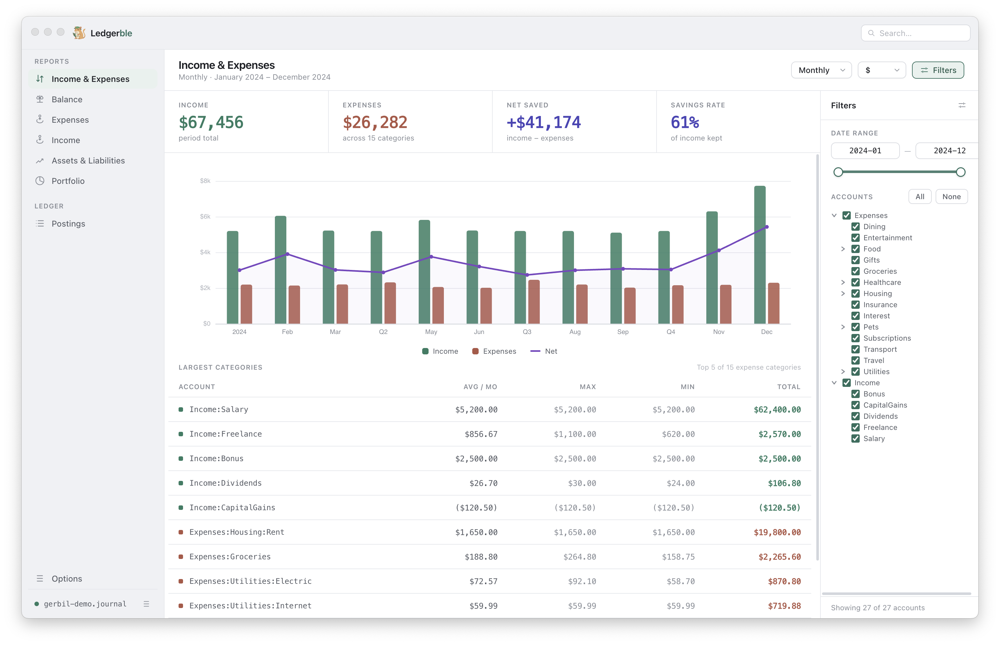
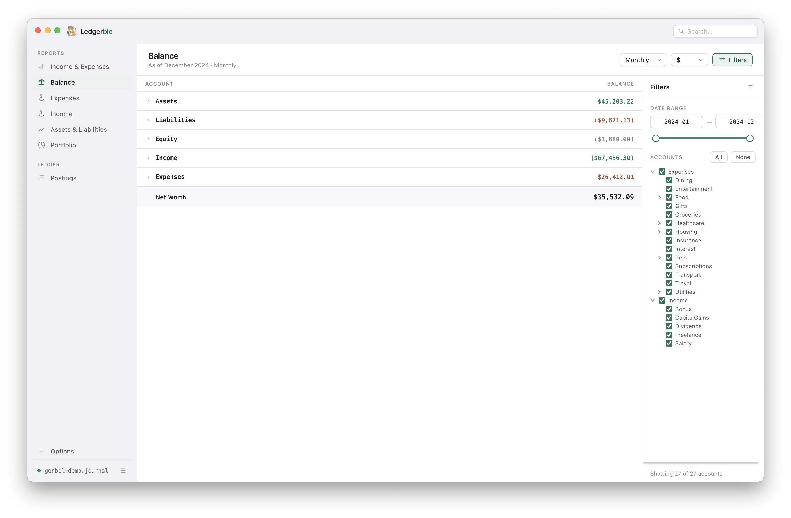
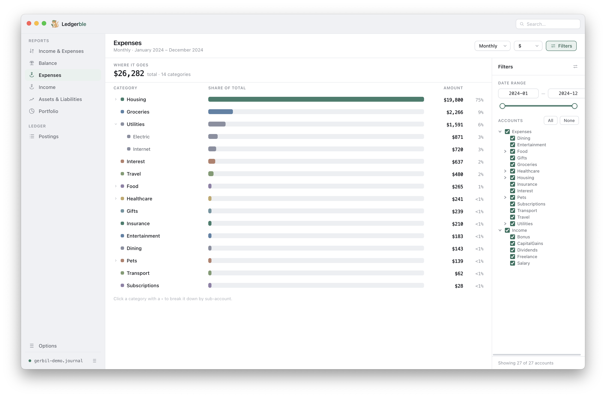
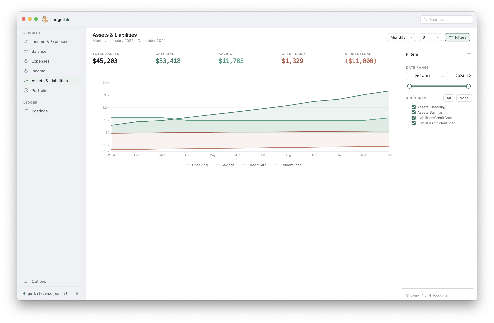
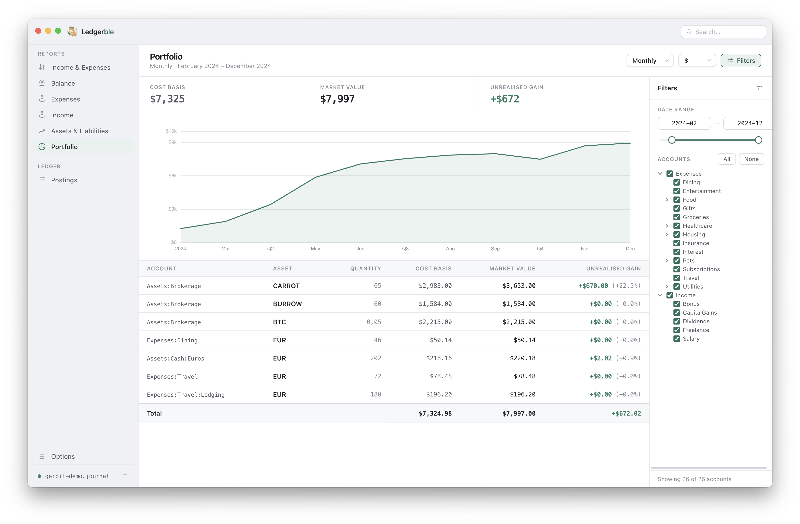
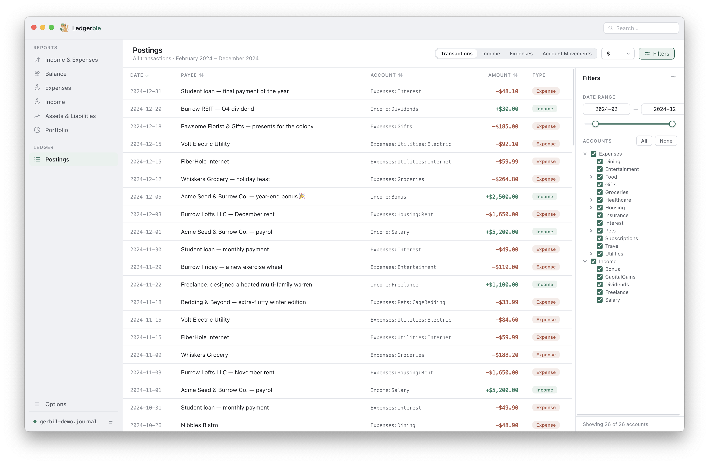

<div align="center">

# Ledgerble

**A friendly desktop dashboard for your [ledger-cli](https://www.ledger-cli.org/) (and [hledger](https://hledger.org/)) books.**

Ledgerble reads your plain-text accounting files and turns them into interactive
charts and tables — income vs. expenses, net worth over time, account balances,
asset allocation and a full portfolio valuation. Your data never leaves your
machine.



</div>

---

## What you can do

### 📊 Income & Expenses at a glance

The home view answers the first question everyone has: *am I saving money?*
A headline strip shows **income**, **expenses**, **net saved** and your
**savings rate** for the selected period, above a bar-and-line chart of income
vs. expenses with a running **net** line. Below it, your largest spending
categories are ranked with their average, min, max and total — expand to see
every category at once.


### 🌳 Balance

See where everything stands **as of any point in time** — a navigable tree of
Assets, Liabilities, Equity, Income and Expenses, totalled into your **net
worth**. Drill from top-level accounts down into sub-accounts, and move the
timeline to watch balances evolve.



### 🧾 Expenses & Income breakdowns

Dedicated breakdown views for **where money goes** and **where it comes from**.
Each category shows its share of the total with proportional bars; click a
category to break it down by sub-account. Categories are derived automatically
from your account names — no manual tagging required.



### 🏦 Assets & Liabilities

Track **net worth over time**. An area/line chart layers each asset and
liability account so you can see your cash, savings and debts grow (or shrink)
across the year, with headline totals for each account. Toggle individual
accounts on and off to focus on what matters.



### 📈 Portfolio

For anyone holding shares, funds or crypto, Ledgerble computes a real
**portfolio valuation**: per-holding **cost basis**, current **market value**
and **unrealised gain/loss**, plus the total portfolio value over time. Prices
come straight from the `P` price directives in your journal — historical prices
are looked up automatically, so a holding is always valued at the most recent
price on or before each date.



### 📋 Postings

Browse **every transaction** in one sortable table — date, description, account,
amount and type. Filter to just income, expenses or account movements to find
exactly what you're looking for.



### 💱 Multi-currency

Hold euros, dollars, bitcoin and a vegetable stock or two side by side.
Ledgerble detects your **base currency** automatically and lets you switch the
**display currency** from a dropdown — every chart and total is re-valued on the
fly using the exchange rates in your journal (direct or inverse).

### 🗓️ Periods & focus

Bucket your data by **day, week, month, quarter or year**, narrow everything to
a custom **date range**, and **deselect accounts** to declutter a chart. The
views recompute instantly.

### 📁 Multiple files

Open as many journals as you like at once — they're merged into one picture.
Ledgerble understands `include` directives and **de-duplicates** files that are
already pulled in by another, so nothing is ever double-counted. Each file can
be reloaded or revealed in your file manager from the footer.

### 🖨️ Print & export

Print any view or **export it to PDF** with a layout designed for paper, so you
can file a clean monthly or yearly statement.

### 🌍 12 languages

The interface ships fully localised in **12 languages**: English, German,
Spanish, French, Italian, Dutch, Polish, Portuguese, Russian, Japanese, Korean
and Simplified Chinese.

### 🔒 Private by design

Ledgerble is a local desktop app. It shells out to the `ledger`/`hledger` binary
already on your machine and renders the result — **nothing is uploaded, no
account is required, no telemetry.**

---

## Try it instantly

A complete demo journal ships with the app at
[`examples/gerbil-demo.journal`](examples/gerbil-demo.journal) — a full year of
(made-up) finances for a financially-savvy gerbil. It exercises every feature
above: salary and freelance income, a dozen expense categories, a stock/crypto
portfolio with gains *and* a loser, a foreign-currency trip, dividends and a
credit-card balance. Open it from the **File** menu to explore Ledgerble without
touching your own books first.

---

# For technical users

## Download & Installation

First install [ledger-cli](https://www.ledger-cli.org/) (or
[hledger](https://hledger.org/)).

Then grab the matching file for your system from the
**[latest release](https://github.com/unterricht/ledgerble/releases/latest)**:

| System            | File              |
| ----------------- | ----------------- |
| macOS             | `.dmg`            |
| Windows           | `.exe` (or `.zip`)|
| Linux             | `.AppImage`       |

If `ledger` isn't on your `PATH`, point to the ledger executable in the Options
screen. After starting, use the **File** menu to select and open your ledger
file.

> **Note on security warnings:** the released apps are **not code-signed**
> (signing requires paid Apple/Windows developer certificates). Your operating
> system will therefore warn you the first time you open Ledgerble. This is
> expected for open-source software — see the per-platform notes below.

### macOS

1. Open the `.dmg` and drag **Ledgerble** into your Applications folder.
2. The first launch shows *"Ledgerble cannot be opened because the developer
   cannot be verified."* — **right-click** the app and choose **Open**, then
   confirm with **Open** in the dialog. macOS remembers this choice afterwards.

### Windows

1. Run the `.exe` installer (or unzip the `.zip` and run `ledgerble.exe`).
2. If Windows SmartScreen shows *"Windows protected your PC"*, click
   **More info → Run anyway**.

### Linux

1. Make the downloaded file executable: `chmod +x Ledgerble-*.AppImage`
2. Run it: `./Ledgerble-*.AppImage`

## How it works

Ledgerble does **not** implement plain-text accounting itself — it visualises
what the CLI produces.

- It's a security-hardened **Electron** app (`nodeIntegration: false`,
  `contextIsolation: true`). The renderer has no direct Node/Electron access and
  talks to the main process only through a narrow preload bridge.
- The **main process** spawns your `ledger`/`hledger` binary. For ledger it runs
  three commands in parallel — `csv` (market amounts), `csv -B` (cost basis) and
  `prices` — and parses the output with `papaparse`. For hledger it runs
  `register -O csv`.
- The **renderer** is a React 18 app (bundled with esbuild) that charts the
  parsed postings with [ECharts](https://echarts.apache.org/). A valuation
  engine tracks running quantity and cost basis per account/commodity, walks
  historical prices backwards to value each holding, and converts between
  currencies.
- **Account classification is regex-driven.** There's no fixed chart of
  accounts — each account is classified as income/expenses/assets/liabilities/
  equity by matching configurable regexes (e.g. `^expenses?(:|$)`). Adjust them
  in the Options screen to fit your naming scheme.

`ledger` and `hledger` are both supported; pick which one to use via the toggle
in Options (it must be installed and on your `PATH`, or pointed to explicitly).

## Build it yourself

Prefer to build from source instead of trusting a prebuilt binary? You can.
You need [Node.js](https://nodejs.org/) (with npm) installed.

```bash
git clone https://github.com/unterricht/ledgerble.git
cd ledgerble
npm install
npm run dist        # builds installers for YOUR current operating system
```

The finished installer(s) land in the `dist/` folder. To target a specific
platform explicitly (cross-building may require extra tooling, e.g. Wine for
Windows builds):

```bash
npm run dist:mac
npm run dist:win
npm run dist:linux
```

To just run the app from source without packaging:

```bash
npm start           # bundles the renderer + launches electron
```

## Development

```bash
npm start            # bundle the renderer (esbuild) + launch electron
npm run bundle       # esbuild src/app/index.jsx -> dist/bundle.js
npm test             # jest (all tests in test/)
```

The renderer is bundled into `dist/bundle.js`, so **renderer changes require a
re-bundle** — editing `src/` and re-running electron without bundling will
appear to do nothing (just use `npm start`). There is no lint or typecheck step;
the codebase is plain CommonJS JavaScript. See [`CLAUDE.md`](CLAUDE.md) for a
fuller architecture tour.

## For maintainers: cutting a release

Releases are built automatically by GitHub Actions
([`.github/workflows/release.yml`](.github/workflows/release.yml)). Bump the
version in `package.json`, then push a matching tag:

```bash
git tag v2.0.0
git push origin v2.0.0
```

The workflow builds macOS, Windows and Linux installers on their respective
runners and attaches them to the GitHub release for that tag.
