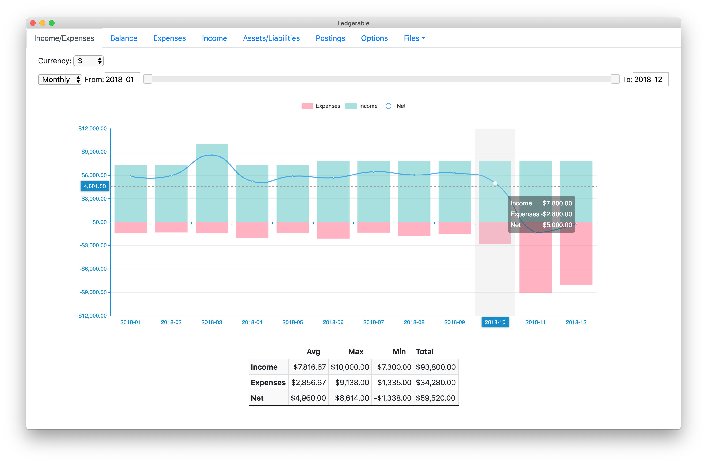
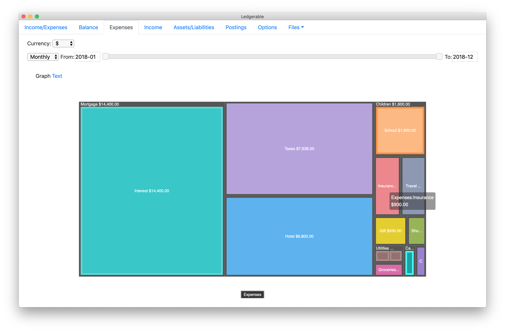
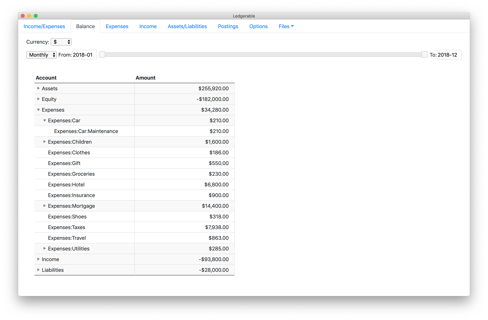

# ledgerble

A ui for [ledger-cli](https://www.ledger-cli.org/) files

# Download & Installation

First install [ledger-cli](https://www.ledger-cli.org/).

Then grab the matching file for your system from the
**[latest release](https://github.com/unterricht/ledgerble/releases/latest)**:

| System            | File              |
| ----------------- | ----------------- |
| macOS             | `.dmg`            |
| Windows           | `.exe` (or `.zip`)|
| Linux             | `.AppImage`       |

If `ledger` isn't on your `PATH`, point to the ledger executable in the Options
screen. After starting, use the "Files" menu to select and open your ledger file.

> **Note on security warnings:** the released apps are **not code-signed**
> (signing requires paid Apple/Windows developer certificates). Your operating
> system will therefore warn you the first time you open Ledgerble. This is
> expected for open-source software — see the per-platform notes below.

## macOS

1. Open the `.dmg` and drag **Ledgerble** into your Applications folder.
2. The first launch shows *"Ledgerble cannot be opened because the developer
   cannot be verified."* — **right-click** the app and choose **Open**, then
   confirm with **Open** in the dialog. macOS remembers this choice afterwards.

## Windows

1. Run the `.exe` installer (or unzip the `.zip` and run `ledgerble.exe`).
2. If Windows SmartScreen shows *"Windows protected your PC"*, click
   **More info → Run anyway**.

## Linux

1. Make the downloaded file executable: `chmod +x Ledgerble-*.AppImage`
2. Run it: `./Ledgerble-*.AppImage`

# Build it yourself

Prefer to build from source instead of trusting a prebuilt binary? You can.
You need [Node.js](https://nodejs.org/) (with npm) installed.

```bash
git clone https://github.com/unterricht/ledgerble.git
cd ledgerble
npm install
npm run dist        # builds installers for YOUR current operating system
```

The finished installer(s) land in the `dist/` folder. To target a specific
platform explicitly (cross-building may require extra tooling, e.g. Wine for
Windows builds):

```bash
npm run dist:mac
npm run dist:win
npm run dist:linux
```

To just run the app from source without packaging:

```bash
npm start
```

# For maintainers: cutting a release

Releases are built automatically by GitHub Actions
([`.github/workflows/release.yml`](.github/workflows/release.yml)). Bump the
version in `package.json`, then push a matching tag:

```bash
git tag v2.0.0
git push origin v2.0.0
```

The workflow builds macOS, Windows and Linux installers on their respective
runners and attaches them to the GitHub release for that tag.

# Screenshots






